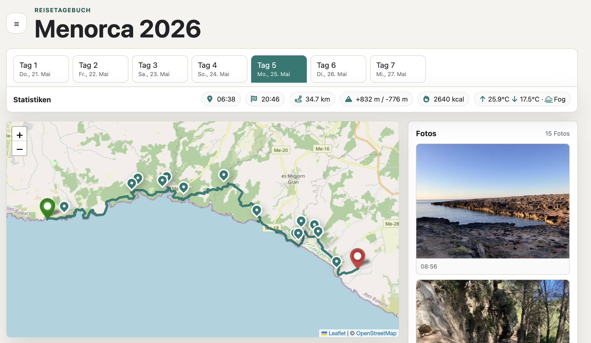

# Travel Journal

App to browse tracks and photos from my travels. <a href="https://stefanroeck.github.io/travel-journal/html/">Go to Deployment</a>

</img>

## Development

### Static web page

Start a local web server from the project root:

```sh
python3 -m http.server 8000
```

Then open:

```text
http://127.0.0.1:8000/html/
```

Serve the page from the project root, not from `html/`, so the browser can load
`travels/travels.json`, GPX tracks, notes, and photos through the relative paths
used by the static page.

Stop the server with `Ctrl-C` in the terminal where it is running.

This project includes a small Python utility for keeping photo GPS metadata in
`travels/travels.json`.

### Python setup

Create and activate a virtual environment:

```sh
python3 -m venv .venv
source .venv/bin/activate
python -m pip install -e .
```

This installs Pillow, which the metadata script uses to read photo EXIF data.

### End-to-end tests

The repository includes a Playwright test harness for the static app.

Install dependencies and browser binaries:

```sh
npm install
npx playwright install --with-deps
```

Run the E2E suite:

```sh
npm run test:e2e
```

Run TypeScript typechecking for the E2E tests:

```sh
npm run typecheck:e2e
```

Playwright launches a local Python web server automatically and navigates to `http://127.0.0.1:8000/html`.

### Utility scripts

- `python scripts/update_photo_metadata.py`
  - Extracts EXIF GPS and timestamp metadata from `photos/*.png` and syncs it into
    `travels/travels.json`.
  - Use `--overwrite` to refresh existing values.
- `python scripts/generate_photo_thumbnails.py`
  - Creates JPEG thumbnails under `photos/thumbnails/` and updates `travels.json`
    with thumbnail paths.
- `python scripts/convert_fit_to_gpx.py`
  - Converts Garmin `.fit` files from `tracks/` into `.gpx` and updates
    `travels/travels.json` with track entries.
  - Use `--simplify` to reduce number of waypoints for smaller file sizes
- `python scripts/fetch_weather_for_travels.py`
  - Fetches daily weather from Open-Meteo and stores it under each track in
    `travels/travels.json`.
